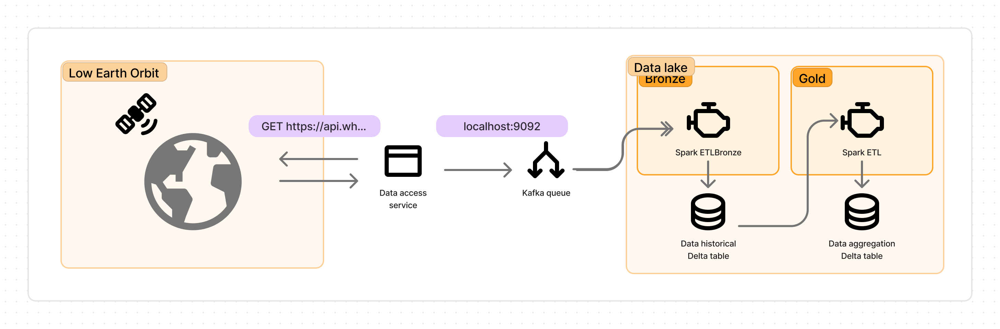

# Spark Streaming and Delta lake

## Context

We’re big data engineers working in the ESA (European Space Agency). After a technical meeting we’ve been tasked to create a pipeline with real-time data from ISS (International Space Station) involving a data lake creation for historical data and also a service which takes the higher altitude the satellite reaches for aerospacial researching purposes.

Our colleagues from ground control developed a service exposing an REST-API endpoint so that when we send a GET HTTP message, we get current information from the satellite.

After a thorough revision of the briefing, you and your team mates came up with the following service architecture:



The architecture is not very complicated, but it’s effective and scalable. 

- We set up first a script in python which sets a loop that queries the ground control API service each .5 seconds. If the request is successful it produces a kafka message in the “iss” topic.
- Kafka cluster is simple now, is just a broker with a zookeeper together. We have only a only kafka instance, but it could scale up horizontally with more kafka servers.
- In the data lake, we have drawn two sections inside following the medallion architecture with just two stages. The first one is the bronze stage, in which we just parse the JSON data coming from the kafka broker and converting it to a spark table with Spark structured streaming API and storing it with deltalake connector.
- The second one is the gold stage in which we aggregate data using again Spark structured API, but this time consuming real time data stream from deltalake.

## Setting up project

### Docker environment

The kafka broker, zookeeper and the data access service are dockerized. It’s important to review carefully how this setup has been done. Feel free to checkout the docker-compose.yaml, and the data-source/src/main.py file to gain understanding of the environment behind the scenes. 

Launch the docker environment opening a shell session on the root folder and type:

```bash
docker compose up -d 
```

If you want to restart or tear down the environment just type:

```bash
docker compose down
```

### Checkout kafka incoming data

To check the incoming messages in the “iss” topic, lets get into the kafka container and use the kafka-console-consumer utility to see the data flow. 

```bash
docker exec -it kafka sh
```

And in the container session, type:

```bash
/bin/kafka-console-consumer --bootstrap-server localhost:9092 --topic iss
```

And you see the data flowing like that: 

```json
{"name": "iss", "id": 25544, "latitude": -48.947826322504, "longitude": 125.29514904266, "altitude": 433.83561822897, "velocity": 27538.217323796, "visibility": "daylight", "footprint": 4577.1935346024, "timestamp": 1714032708, "daynum": 2460425.8415278, "solar_lat": 13.394772525764, "solar_lon": 56.529414593886, "units": "kilometers"}
{"name": "iss", "id": 25544, "latitude": -48.969416507533, "longitude": 125.38312401158, "altitude": 433.84568019422, "velocity": 27538.194159784, "visibility": "daylight", "footprint": 4577.2437734697, "timestamp": 1714032709, "daynum": 2460425.8415394, "solar_lat": 13.394776271319, "solar_lon": 56.525247467118, "units": "kilometers"}
{"name": "iss", "id": 25544, "latitude": -49.012376588641, "longitude": 125.55931500715, "altitude": 433.86570018068, "velocity": 27538.148067913, "visibility": "daylight", "footprint": 4577.3437302068, "timestamp": 1714032711, "daynum": 2460425.8415625, "solar_lat": 13.394783762579, "solar_lon": 56.516913045926, "units": "kilometers"}
```

To exit this utility, just `Ctrl+C`, and to exit the container session just type `exit`

Now we have or project up and running. 

### Sbt and Java setup

First, make sure that you have sbt and java 1.8 installed in your machine. 

```bash
 which sbt
```

And for java, we’ll use sdkman to check our java version. 

```bash
sdk version
```

Let’s make sure, our java version is 1.8.

```bash
sdk current java
```

If it’s not the case, just: 

```bash
sdk install java 8.0.412-amzn
dk default java 8.0.392-amzn 
```

### Launch Bronze ETL

Now we’re going to launch or first spark job. Instead of working with spark-submit, we just work with sbt. 

```bash
cd etl
sbt "runMain etsit.ging.etl.etl_bronze.EtlBronze"
```

If all works out properly, you should see a lot of logs of bootstraping spark services and after, a recurrent log trace of the mini batches produced by the spark streaming writestream in console. 

You also will notice that a new folder called `data` has been created in your root folder. Feel free to checkout what is inside, you’ll see there are a lot of parquet files and also the transaction logs. 

If in the logs you see weird ERROR logs, WARN logs but the pipeline is still working, do not worry, those are related to checkpoint locations, or offset kafka caches, ect. 

### Launch Gold ETL

```bash
sbt "runMain etsit.ging.etl.etl_gold.EtlGold"
```

If all works out properly, you should see a lot of logs of bootstraping spark services and after, a recurrent log trace of the mini batches produced by the spark streaming writestream in console. 

If in the logs you see weird ERROR logs, WARN logs but the pipeline is still working, do not worry, those are related to checkpoint locations, or offset kafka caches, ect.