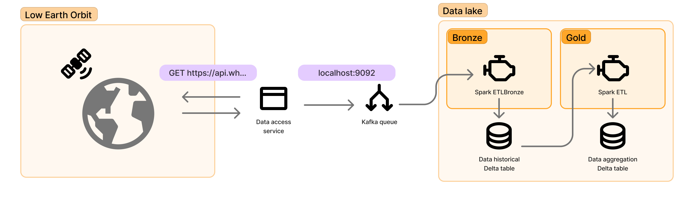

<br/><br/>


# Practica Data Lakes - Delta Lake

## 1. Objetivo

- Afianzar los conceptos sobre Data Lakes
- Identificar las arquitecturas de Big Data y su implicación en los Data Lakes
- Conocer y operar sobre las distintas alternativas de implementaciónes de Data Lakes


## 2. Dependencias

Para realizar la práctica el alumno deberá tener instalado en su ordenador:
- Herramienta GIT para gestión de repositorios [Github](https://git-scm.com/downloads)
- Apache Kafka
- Python
- Spark
- SBT
- Máquina virtual con sistema operativo linux y distribución Ubuntu 22.04 (Disponible en el enlace compartido en moodle) 


## 3. Descripción de la práctica

La práctica plantea un ejercicio que permite identificar la capruta de datos desde una fuente externa, para posteriormente aplicar el Schema-on-read referente Data Lakes y realizar la visualización de dichos datos haciendo uso de las diferentes etapas de consolidación de los datos por medio de las zonas bronze, silver y gold de los Data Lakehouses. El objetivo es comprender como se definen los esquemas de lectura de los datos usando tecnologías como Delta Lake y Apache Iceberg. 

Cabe recalcar que al ser un entorno de Big Data se involucran muchos componentes utilizados en otras prácticas como Kafka, Spark, SBT entre otros.

La práctica está desarrollada en dos bloques. Uno con instrucciones específicas tanto para desplegar el entorno como para ejecutar los programas que han sido desarrollados usando Delta Lake como formato de tablas. 

El segundo bloque plantea el mismo entorno de ejecución (con un desarrollo no guiado) pero se pide que se modifiquen los programas para que los datos sean leídos usando el formato de tablas de Apache Iceberg. 

Los datos de entrada tanto para los bloques uno y dos de la práctica utilizan un API externa que devuelve los datos de la ubicacición de la Estación Espacial Internacional (ISS International Space Station). Estos datos son solicitados con una fecuencia de 0.5 segundos. Por lo tanto, el esquema de la arquitectura de la práctica sería el siguiente:



## 4. Inicializar el entorno.

Para la realización de la práctica se ha provisionado una máquina virtual con sistema operativo linux y distribución Ubuntu. En los recursos de Moodle de la asignatura se acceder al enlace de descarga.

Descarge el fichero de VM con extensión .ova e importelo en virtualbox. 

Dentro de la máquina virtual abra un terminal y realice los siguientes pasos.


### Verificar el entorno de SBT y Java 

Verificar la versión de java 1.8 y sbt instalada. 

```bash
 which sbt
```

Para verificar la versión de java usar sdkman. 

```bash
sdk version
```

Asegurarnos que la versión de java  es la  1.8.

```bash
sdk current java
```

Si ese no es el caso, realizar lo sigiuente: 

```bash
sdk install java 8.0.412-amzn
sdk default java 8.0.392-amzn 
```


**Iniciar Kafka para recibir los eventos en un tópico**

Cambiar el directorio de trabajo para ejecutar los binarios de la distribución de Kafka:
```
cd ./Downloads/kafka_2.12-3.4.0
```

Iniciar el servicio de Kafka con KRaft:

Generar el Cluster UUID:
```
KAFKA_CLUSTER_ID="$(bin/kafka-storage.sh random-uuid)"
```

Indicar el formato de logs:

```
bin/kafka-storage.sh format -t $KAFKA_CLUSTER_ID -c config/kraft/server.properties
```

Iniciar el servicio de Kafka:

```
bin/kafka-server-start.sh config/kraft/server.properties
```
Al ejecutar dicho comando el servicio de Kafka se habrá arrancado y como salida se verán los logs de inicialización, recuerde no cerrar el teminal a menos que se quiera detener dicho servicio.

Abrir otra terminal para crear el tópico a usar en esta práctica

Usando como directorio de trabajo la carpeta donde se encuentran los binarios de Kafka, crear el tópico a usar, ejecutando lo siguiente:

```
bin/kafka-topics.sh --create --topic iss --bootstrap-server localhost:9092

```

Donde `iss` es el nombre del tópico que vamos a crear y `localhost:9092` es el hostname y el puerto del servidor donde se está ejecutando Kafka.

Verifique que el tópico se ha creado correctamente con la siguiente instrucción:

```
bin/kafka-topics.sh --describe --topic quickstart-events --bootstrap-server localhost:9092

```
**Iniciar el consumidor para leer los eventos que han sido enviados al tópico**

Abrir otra treerminal, para verificar que los eventos se están escribiendo en el tóipico correspondiente.

```
bin/kafka-console-consumer.sh --topic iss --from-beginning --bootstrap-server localhost:9092
```
Al ejecutar el comando anterior se inicia un consumidor y por lo tanto, todos los mensajes que fueron publicados en dicho tópico se mostrarán en la consola.

```
{"name": "iss", "id": 25544, "latitude": -48.947826322504, "longitude": 125.29514904266, "altitude": 433.83561822897, "velocity": 27538.217323796, "visibility": "daylight", "footprint": 4577.1935346024, "timestamp": 1714032708, "daynum": 2460425.8415278, "solar_lat": 13.394772525764, "solar_lon": 56.529414593886, "units": "kilometers"}
{"name": "iss", "id": 25544, "latitude": -48.969416507533, "longitude": 125.38312401158, "altitude": 433.84568019422, "velocity": 27538.194159784, "visibility": "daylight", "footprint": 4577.2437734697, "timestamp": 1714032709, "daynum": 2460425.8415394, "solar_lat": 13.394776271319, "solar_lon": 56.525247467118, "units": "kilometers"}
{"name": "iss", "id": 25544, "latitude": -49.012376588641, "longitude": 125.55931500715, "altitude": 433.86570018068, "velocity": 27538.148067913, "visibility": "daylight", "footprint": 4577.3437302068, "timestamp": 1714032711, "daynum": 2460425.8415625, "solar_lat": 13.394783762579, "solar_lon": 56.516913045926, "units": "kilometers"}
```

**Clonar el repositorio y acceder a los recursos de la práctica**

Abrir un terminal nuevo y clonar el repositorio de la práctica

```
git clone https://github.com/Big-Data-ETSIT/P8_DATA_LAKE.git
```
Cambiar la ruta al directorio de la práctica
```
cd ./P8_DATA_LAKE
```

### Captura de eventos de la ISS por medio de KAFKA

Para todas los bloques de la práctica hay que tener en cuenta que para recibir los eventos con la posición actual de la ISS hay que ejecutar el programa de python que hace la llamada al API correspondiente. Para ello debemor hacer lo siguiente:

Abir un terminal y movernos hacia la carpeta `data-source` dentro del directorio de la práctica:

```
cd ./data-source
```

Crear el entorno virtual de pythonn e instalar las dependencias:

```
python3 -m venv env
source env/bin/activate
pip install -r requirements.txt
```

Iniciar el programa (recordar no cerrar ese terminal, caso contrario no se podrán obtener los datos de entrada) :

```
python3 src/main.py
```

## 5. Tareas a realizar.

### Bloque 1: Captura y alamacenamiento de los eventos de la ISS por medio de KAFKA y Delta Lake.

Para poder almacenar los datos de streaming dentro del Lago de Datos se provee de dos programas desarrollados en scala. Uno para la captura de datos en crudo (raw) que equivale a la zona Bronze de un Data Lakehouse y otra de  los datos con una agregación que euivale a la zona Gold.

La ejecución de cada uno de esos programas se realiza utilizando SBT y Spark como motor de procesamiento.

Para ejecutar cada uno de los programas se debe realizar lo sigiuente:

### Ejecutar el programa para almacenar en la zona Bronze 

```bash
cd etl
sbt "runMain etsit.ging.etl.etl_bronze.EtlBronze"
```

Si todo funciona correctamente, se debería visualizar una gran cantidad  de logs de arranque de los servicios de spark y después, una traza de logs recurrente de los mini batches producidos por el flujo de escritura de spark en consola. 

En este punto cuando se visualicen los datos realizar una captura (Captura 1) y almacenarla para poder realizar el informe como parate de la entrega.

Adicionalmente,  se debe verificar que se ha creado una nueva carpeta llamada `data` dentro de la  carpeta raíz. Comprobar lo que hay dentro, varificar que hay una gran cantidad de archivos parquet además también de los logs de transacciones. (Captura 2)

Si en los logs se vusializan logs de ERROR extraños, logs WARN pero todo sigue funcionando, hacer caso omiso de ellos, estas salidas sulen estár relacionadas con las ubicaciones de punto de control, o cachés kafka offset, etc. 


### Ejecutar el programa para almacenar en la zona Gold 

```bash
sbt "runMain etsit.ging.etl.etl_gold.EtlGold"
```

Al igual que en la sección anterior, si todo se ejecuta correctamente se debería visualizar en la salidad de la consola los mini batches con la información agregada. Asímismo para esta parte realizar la captura correspondiente (Captura 3)


### Bloque 2: Uso de Apache Iceberg.

Para esta sección se solicita la modificación del código de cada uno de los programas desarrollados en scala para que en lugar de usar el formato de tablas de Delta Lake se use el de Apache Iceberg. Esta sección generaría de esta forma 3 Capturas adicionales (Captura 4,5,6) que deberá adjuntarlas al informe de la práctica.

## 6. Instrucciones para la Entrega y Evaluación.
El alumno debe subir un fichero pdf a moodle en donde se incluyan las dos capturas solicitadas y una descripción de las mismas. Adicionalmente, se deben subir junto con el informe los programas (.scala o la carpeta src) con la modificación de los programas correspondientes al boque 2 de la práctica.


